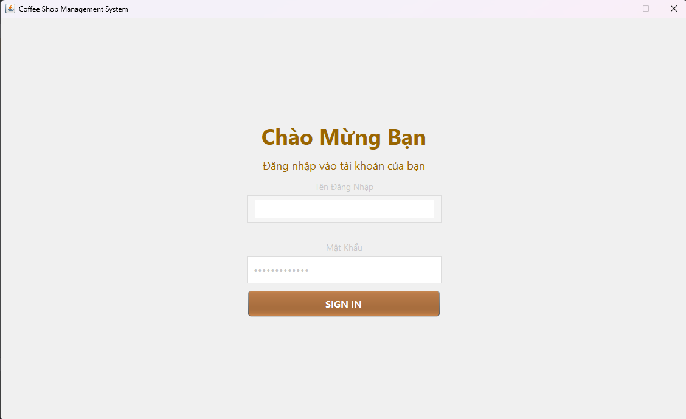
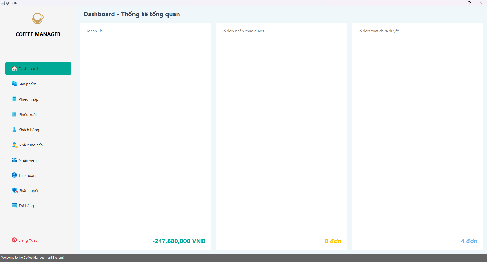
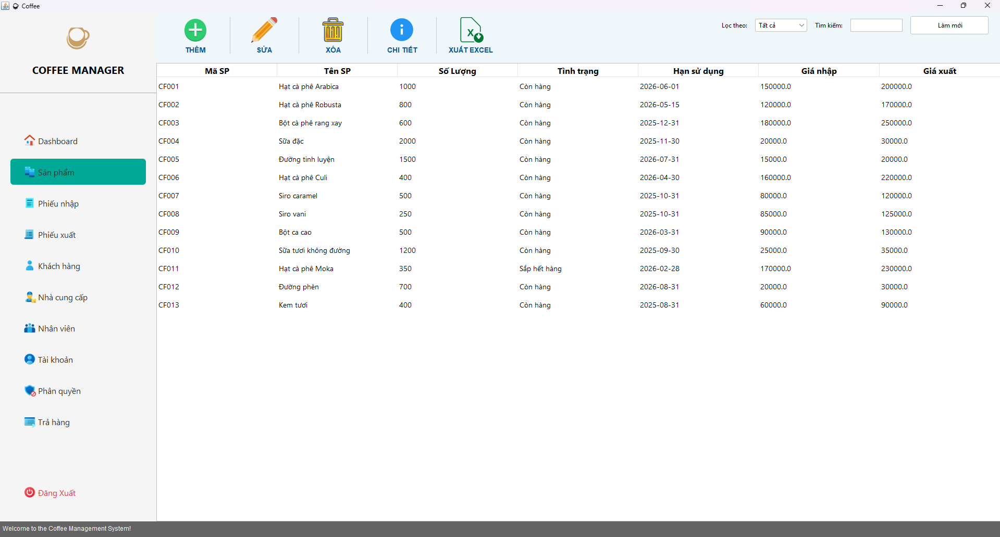
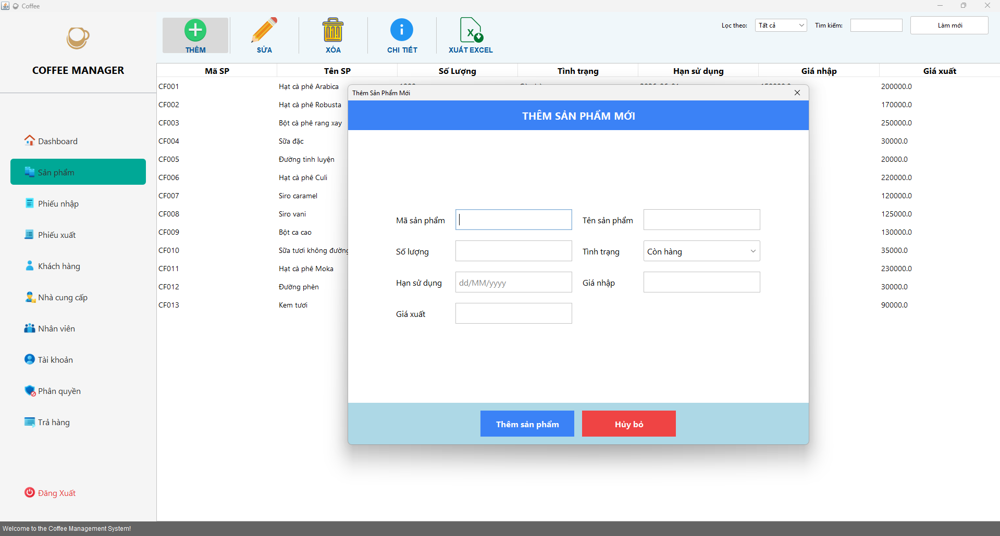
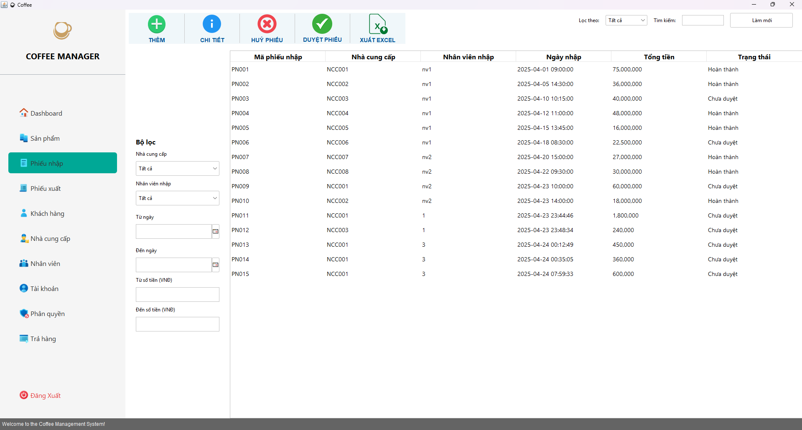
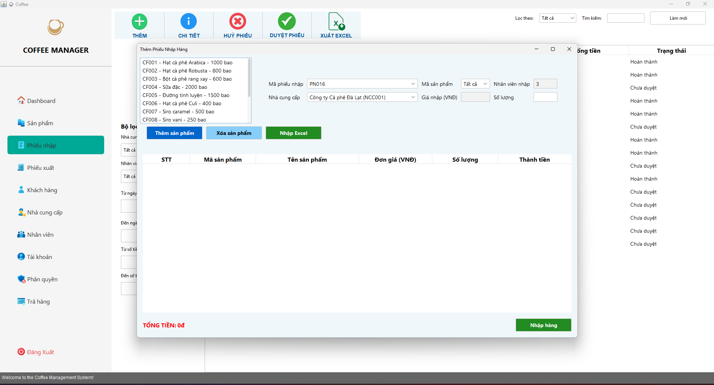
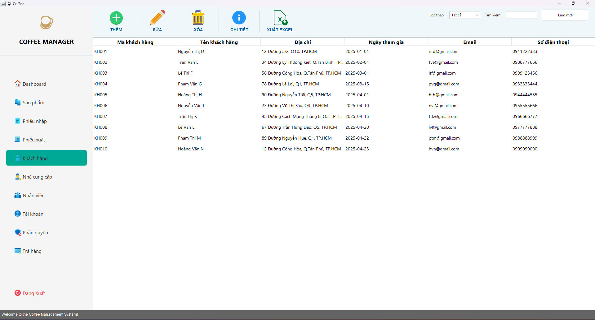

# Đồ án môn Phân tích thiết kế hệ thống thông tin
 Đề tài: Quản lý kho hàng điện thoại thông minh theo mã imei
 ### 
 File báo cáo vào slide PowerPoint nằm trong thư mục BaoCaoPTTKHTTT

## Getting Started

1. Tải source code về:

   ```bash
   git clone https://github.com/Gino1216/QuanLyKhoHangCaPhe.git
   ```
2. Mở xampp và vào trang http://localhost/phpmyadmin/ tạo 1 database mới có tên là Quanlycuahang2 và import cơ sở dữ liệu trong folder database -> file db.sql trong source code.

3. Sử dụng netbeans để chạy source code.
### Tài khoản Admin
- Username: 3
- Password: 3
### Giao diện
 
 
 <h4 align="center">Đăng nhập</h4>
 


 <h4 align="center">Trang chủ</h4>
 


 <h4 align="center">Sản phẩm</h4>
 


 <h4 align="center">Thêm sản phẩm</h4>



 <h4 align="center">Phiếu nhập</h4>
 


 <h4 align="center">Chi tiết phiếu nhập</h4>
 

